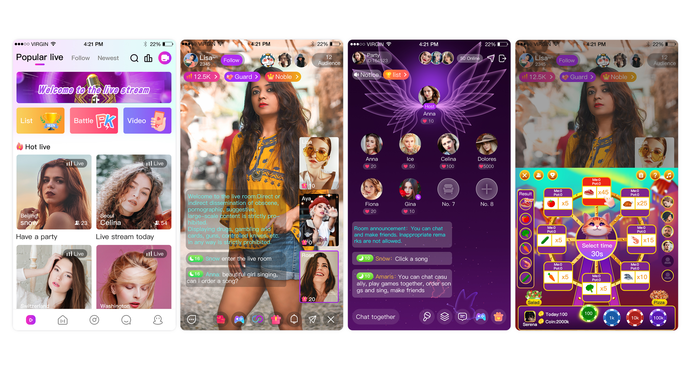
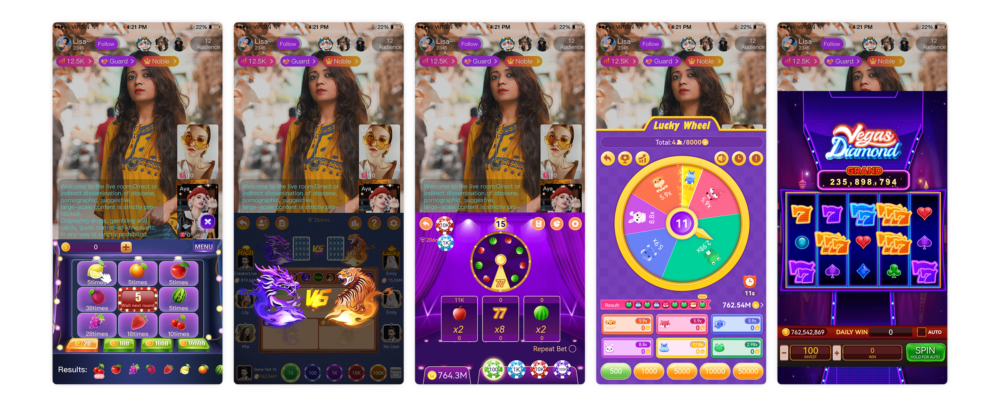
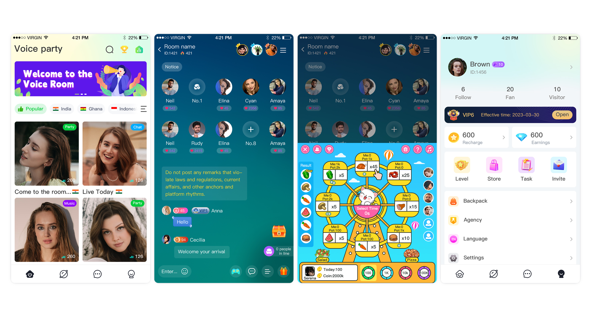
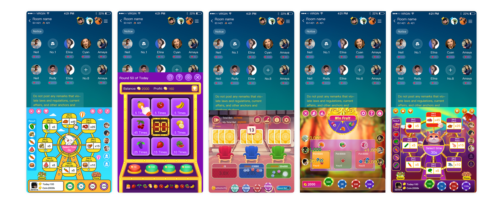

# Live Streaming & Voice Chat App Source Code Solutions

> Professional source code solutions for live streaming platforms and voice chat applications. Ready-to-deploy, scalable, and feature-rich applications similar to BigoLive and popular voice chat platforms.

## 🚀 Product Overview

We provide complete source code solutions for two major categories of social entertainment applications:

### 📺 Live Streaming Platform (BigoLive Style)
Professional live streaming application with comprehensive features for content creators and viewers.

| Main Interface | Gaming Features |
|:---:|:---:|
|  |  |
| *Complete live streaming platform with user management* | *Integrated gaming and interactive features* |

### 🎙️ Voice Chat Room Application
Advanced voice chat platform designed for real-time audio communication and social interaction.

| Main Interface | Gaming Integration |
|:---:|:---:|
|  |  |
| *Multi-room voice chat with advanced audio controls* | *Gaming features and interactive entertainment* |

## ✨ Key Features

### Live Streaming Platform Features
- **Real-time Video Streaming** - High-quality live video broadcasting
- **Interactive Chat System** - Real-time messaging and engagement
- **Virtual Gifts & Monetization** - Complete virtual economy system
- **User Management** - Comprehensive user profiles and authentication
- **Gaming Integration** - Built-in games and interactive features
- **Multi-platform Support** - iOS and Android native applications
- **Admin Dashboard** - Complete backend management system

### Voice Chat Application Features
- **Multi-room Audio Chat** - Support for multiple simultaneous chat rooms
- **High-quality Audio** - Crystal clear voice communication
- **Room Management** - Advanced room creation and moderation tools
- **Social Features** - Friend systems, profiles, and social interactions
- **Gaming Elements** - Integrated games and entertainment features
- **Monetization Tools** - Virtual gifts and premium features
- **Cross-platform Compatibility** - Seamless experience across devices

## 🛠️ Technical Stack

### Frontend Technologies
- **iOS**: Swift, UIKit, AVFoundation
- **Android**: Kotlin/Java, Android SDK, MediaPlayer
- **Cross-platform**: React Native / Flutter options available

### Backend Technologies
- **Server**: Node.js, Python Django, or Java Spring Boot
- **Database**: MySQL, PostgreSQL, Redis
- **Real-time Communication**: WebRTC, Socket.io
- **Media Streaming**: RTMP, HLS, WebRTC
- **Cloud Services**: AWS, Google Cloud, or Azure compatible

### Key Integrations
- **Payment Systems**: Multiple payment gateway integrations
- **Push Notifications**: Firebase, APNs
- **Analytics**: Custom analytics and reporting systems
- **CDN**: Content delivery network for global reach
- **Security**: End-to-end encryption and secure authentication

## 📱 Platform Support

- ✅ **iOS** (iOS 12.0+)
- ✅ **Android** (API Level 21+)
- ✅ **Web Dashboard** (Admin Panel)
- ✅ **API Documentation** (Complete REST API)

## 🎯 Target Use Cases

### Live Streaming Platform
- **Content Creator Platforms** - YouTube Live, Twitch alternatives
- **Social Entertainment** - Interactive live streaming communities
- **E-commerce Live Streaming** - Live shopping and product demonstrations
- **Educational Platforms** - Live teaching and webinar solutions

### Voice Chat Applications
- **Social Audio Platforms** - Clubhouse-style applications
- **Gaming Communities** - Voice chat for gaming groups
- **Professional Meetings** - Business communication tools
- **Entertainment Platforms** - Interactive audio entertainment

## 💼 What You Get

### Complete Source Code Package
- ✅ **Full iOS Application** - Complete Xcode project
- ✅ **Full Android Application** - Complete Android Studio project
- ✅ **Backend Server Code** - Complete server implementation
- ✅ **Admin Dashboard** - Web-based management interface
- ✅ **Database Schema** - Complete database structure
- ✅ **API Documentation** - Comprehensive API reference
- ✅ **Setup Instructions** - Detailed deployment guide
- ✅ **Technical Support** - Initial setup assistance

### Additional Resources
- 📚 **Documentation** - Complete technical documentation
- 🔧 **Configuration Files** - Ready-to-use configuration templates
- 🎨 **UI/UX Assets** - All design assets and resources
- 🧪 **Testing Suite** - Unit tests and integration tests
- 📊 **Analytics Integration** - Built-in analytics and reporting

## 🚀 Quick Start

1. **Download** the complete source code package
2. **Configure** your development environment
3. **Set up** the backend server and database
4. **Build** and deploy the mobile applications
5. **Customize** features according to your requirements
6. **Launch** your platform

## 💡 Customization Options

Our source code is designed for easy customization:

- **Branding** - Complete white-label solution
- **Features** - Add or remove features as needed
- **UI/UX** - Fully customizable interface design
- **Monetization** - Flexible revenue model implementation
- **Integrations** - Easy third-party service integration
- **Scaling** - Built for horizontal and vertical scaling

## 📞 Contact & Purchase

Ready to launch your live streaming or voice chat platform? Get in touch with us for:

- **Source Code Purchase** - Complete package pricing
- **Custom Development** - Tailored solutions for your needs
- **Technical Consultation** - Expert guidance and support
- **Deployment Assistance** - Professional setup services

### Get Started Today
- 📧 **Email**: [weipeng201707@gmail.com]
- 💬 **WhatsApp**: [Contact us on WhatsApp](https://wa.me/8615715385900?text=I%20saw%20your%20product%20on%20GitHub%20and%20would%20like%20to%20learn%20more%20about%20it)
- 📱 **Telegram**: [@chaoxiaokalami]
---

## 📄 License

This is commercial software. Source code is available for purchase with full commercial rights.

## 🔒 Security & Privacy

- End-to-end encryption for all communications
- GDPR and privacy regulation compliant
- Secure payment processing
- Regular security updates and patches

---

**© 2024 [BogoTech]. All rights reserved.**

*Professional live streaming and voice chat application source code solutions. Ready to deploy, scale, and customize for your business needs.*
